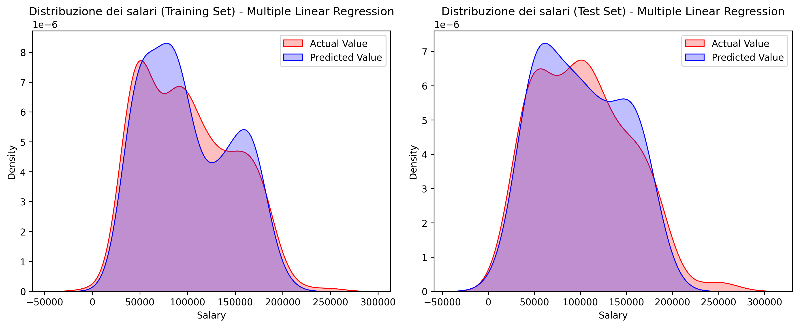

# Salary Prediction con Modelli di Regressione

Questo progetto ha l’obiettivo di prevedere il salario utilizzando modelli di regressione, con particolare attenzione all’analisi dei dati, alla valutazione dei modelli e all’interpretazione dei risultati.

---

## Panoramica del progetto

L’obiettivo è costruire e valutare modelli in grado di predire il salario a partire da diverse variabili esplicative.

Il workflow seguito è il seguente:

- Pulizia e preprocessing dei dati  
- Analisi esplorativa (EDA)  
- Addestramento dei modelli  
- Valutazione delle performance  
- Visualizzazione dei risultati
- Confronto con altri modelli

---

## 📁 Struttura del progetto

salary-prediction-analysis/
├── data/                # Dataset  
├── notebooks/           # Notebook con analisi completa  
│   └── salary_prediction_analysis.ipynb  
├── src/                 # Moduli Python riutilizzabili  
│   ├── preprocessing.py  
│   ├── modeling.py  
│   ├── evaluation.py  
│   ├── plots.py  
├── results/  
│   └── figures/         # Grafici salvati  
├── README.md  

---

## Analisi dei dati

Durante l’analisi esplorativa sono stati studiati:

- Distribuzione dei salari  
- Relazioni tra le variabili  
- Presenza di asimmetrie (skewness)  

---

## Modelli utilizzati

Sono stati implementati i seguenti modelli:

- Regressione Lineare Multipla  
- Ridge Regression  

---

## Valutazione dei modelli

Le performance sono state valutate tramite:

- Root Mean Squared Error (RMSE)
- Mean Absolute Error (MAE)  
- Coefficiente di determinazione (R²)  

Le metriche sono state calcolate:

- nello spazio logaritmico nell'analisi 2 (coerente con il training)  
- nella scala originale (per interpretabilità)  

---

## Visualizzazioni

Il progetto include diversi grafici:

- Confronto tra distribuzioni reali e predette  
- Residual plot  
- Analisi delle correlazioni  

### Esempio: Distribution Plot

---

## Risultati principali

- La trasformazione logaritmica migliora la stabilità del modello  
- La Ridge Regression aiuta a ridurre l’overfitting  
- L’analisi dei residui evidenzia i limiti del modello  

---

## Come eseguire il progetto

1. Clonare la repository:

git clone https://github.com/umbertogallo01/salary-prediction-analysis.git

2. Aprire il notebook:

notebooks/salary_prediction_analysis.ipynb

3. Eseguire tutte le celle

---

## Autore

Progetto sviluppato nell’ambito di un percorso di formazione in Data Science e Machine Learning.
